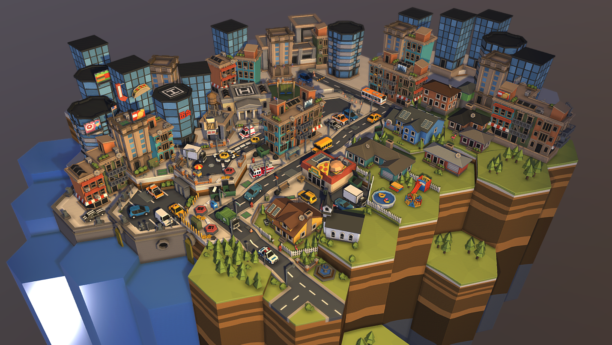

# City Map

_UPDATE: Staking for Cities in exchange for boosted Concentrate rewards have been considered. However, in order to prioritize long-term enjoyability, we want to avoid early players having a strictly unfair advantage of increasing their rate of Concentrate earned, which would increasingly disincentize new users from playing. Instead, we decide to go the direction of increasing Builder and Structure diversity._

## Cities

Cities are a visually appealing, tangible representations - in isometric view - of the progress one's made focusing. From a data perspective, they are stored on-chain as _non-fungible and non-tradeable **soul-bound tokens**_**. Your productivity history is your's forever to keep.** When a Structure is built, they appear in the Inventory. From there, users place the structure onto their map, further developing their city. Selecting a Structure placed on the map will open a view the FocusBuild details associated with that structure (i.e. Builder, minutes spent).

<figure><figcaption>
Drag and Drop City Map Concept
</figcaption></figure>

## 3D Design Inspirations&#x20;

<figure><figcaption></figcaption></figure>

<figure><figcaption></figcaption></figure>

<figure><figcaption></figcaption></figure>
