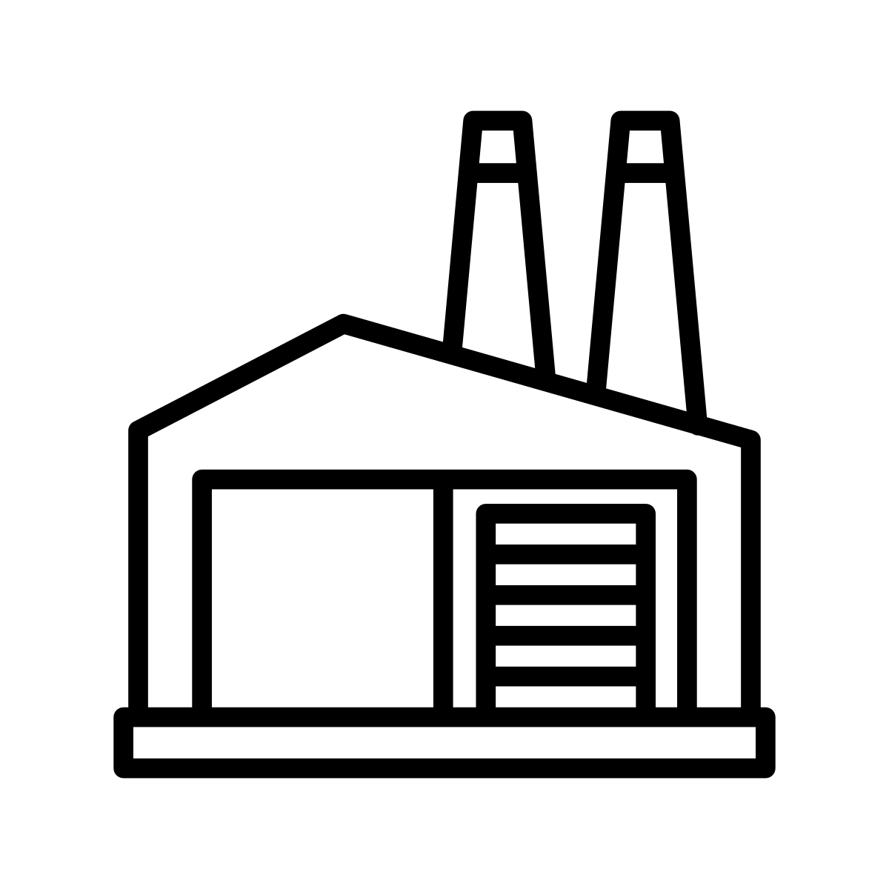
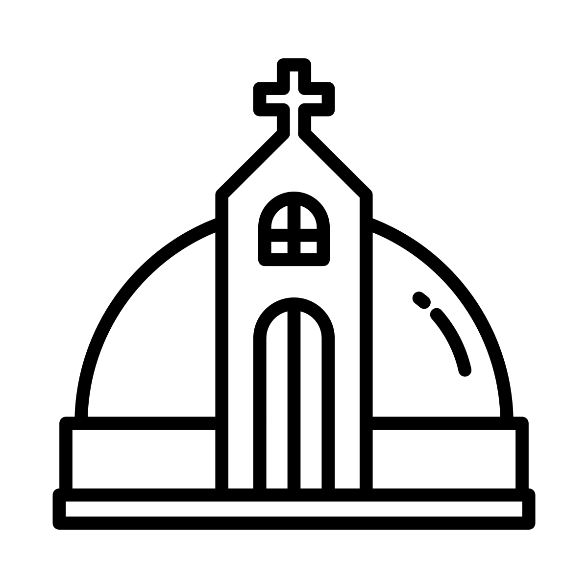

# Structures

Structures are what Cities are made of, and represent the tangible reward for a FocusBuild Session. They are named intentionally because we think there's potential for them to manifest in a limitless amount of Types, Complexities, and Aesthetic Rarity.&#x20;

## **Minimum Time Requirements to Build The Structure**

| Minimum FocusBuild Time | Category             | Types                                         |
| ----------------------- | -------------------- | --------------------------------------------- |
| 20 minutes              | Small Structures     | roads, custom signs, street lights            |
| 45 minutes              | Medium Structures    | single story resident homes, small restaurant |
| 60 minutes              | Large Structures     | 2-3 story buildings, highways                 |
| > 90 minutes            | Very Large Structure | libraries, hospitals, 4+ story buildings      |

**The Type of a Structure is determined by users,  but the Complexity and Rarity of the Structure that the Builder creates within the category is non-deterministic. Distributions of Structure Attributes are parameterized by Builder Attributes, Time Modifier, and Bonuses from the City.** After a successful FocusBuild session, users can chose to spend Concentrate in order to select the specific structure they wanted within their Category.

### **Structure Minting**

Finishing a build will send message to our server that will verify its a legitimate build. Then our server will initiate a mint on the Structure smart contract. Users pay a gas fee for the mint before initiating a FocusBuild in SOL (this psychology commits users to completing a FocusBuild).

## Structure Attributes

* Style - what aesthetic (culture, time period, theme)
* Rarity - likelihood of creating a specific quality of structure (beauty and detail, quality)
  * Rarity = .9 \* Builder Rarity + +1 \* Time Modifier
* Complexity - characterize the Size and Magnitude of the Structure
  * Complexity = .9 \* Time Modifier + .1 \* Builder Rarity

If you have a rarer Builder, it increases the chances that the Structure made will be more detailed and be higher quality.  Contributing more time varies the size and magnitude of the structure. e.g. if you chose to build a road the minimum is 20 minutes but if you decide to invest 1 hour into your road could have more lanes, whether it has a road divider, etc. Using a rare Builder to build this "1-hour-road" would increase the the chances of the road being more visually appealing, its condition, whether it has cracks, etc.&#x20;

### &#x20;Time Modifier = Your Timer / Minimum Time&#x20;

* This Time Modifier is a ratio that contributes to the Rarity and Complexity of the Selected Structure.
* e.g. Road has a base time cost of 20 minutes. Library has a base time cost of 90 minutes. If I spend 20 minutes on a road, and 90 minutes on a library, they will have a Time Modifier of 1 and share the same Rarity | Complexity Table. But If you spend 40 minutes on a road you will get a more complex and rare road. If you spend 180 minutes on a library, you will get a more complex and rare library.

 (2).png>)

.png)

********.png>)****

### **Scalable generation of Structure Assets**

It is a high priority for individual structures to be visually beautiful yet unique, desirable as standalone art, in order to not only keep players engaged by the building process and also have intrinsic economic value for trading purposes.  In order to accomplish this at large scale, we are exploring recent advances in generative machine learning to create structure assets.  In particular, stable diffusion networks have been highly successful in generating 2D art conditioned on text specifications and recent publications have demonstrated its efficacy for 3D modeling as well.  We intend to train or fine tune such a model to convert a structure's parametrizing attributes (structure type, style, rarity, and complexity) to a 3D model.

This would also allow us to explicitly and objectively encode definitions of rarity and complexity by, for instance, training a separate model with larger/deeper hidden layers for the higher rarities and complexities.
