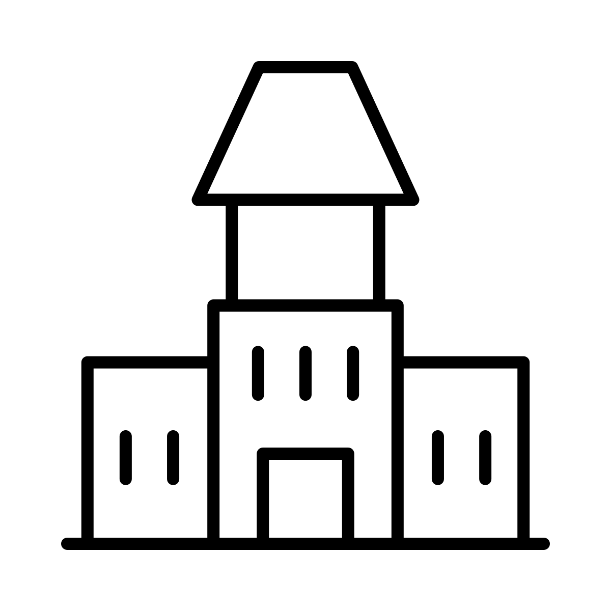
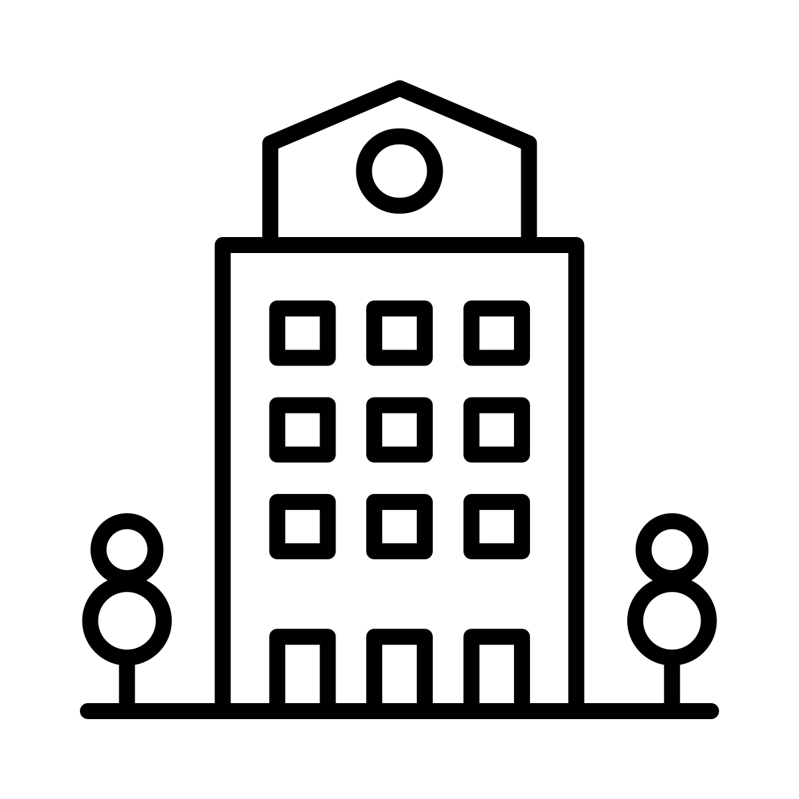

# Structures

"Structures" are named intentionally because we think there's potential for them to manifest in a limitless amount of types, different shapes and sizes. These include not only residential houses, but skyscrapers, libraries, churches, hospitals, and roads. Further into development, we will implement structure design to be associated with how long a FocusBuild session is..png)

.png>).png)

************

**3D Animation Design Potential**

3D Design Concepts for Structures below.&#x20;

